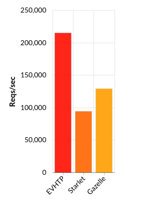
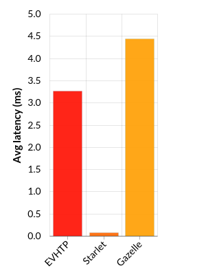
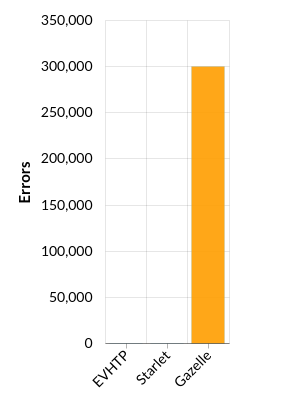

# NAME

**Plack::Handler::EVHTP** - High-performance PSGI/Plack web server using [libevhtp](https://github.com/ellzey/libevhtp).

## SYNOPSIS
Run app.psgi with default settings.
```
plackup -s EVHTP
```
Run that-app.psgi with some settings.
```
plackup -s EVHTP -E production --host 0.0.0.0 --port 5001 --max-workers 8 --max-reqs-per-child 1000000 -a that-app.psgi
```

## DESCRIPTION

Plack::Handler::EVHTP is a web server that uses [libevhtp](https://github.com/ellzey/libevhtp) and [libevent2](http://libevent.org/).

Plack::Handler::EVHTP launches libevhtp server that becomes responsible for all incoming connections and request handling.

This server should be used with a **multi-threaded perl** to allow cloning and management of perl contexts in libevhtp **(p)threads**, otherwise perl context won't be cloned and renewd (--max-reqs-per-child=Inf). **Maximum requests per child** should be kept **high** due to expensive perl_clone.

## OPTIONS

#### --host (default: 0.0.0.0)
Server bind address.

#### --port (default: 5000)
Server bind port.

#### --max-workers (default: 8)
Server worker threads.

#### --max-reqs-per-child (default: 0)
Maximum number of requests to be handled before a perl context gets renewed (app clone).
Disabled by default (app won't get renewed).

## CLONE HANDLING EXAMPLE
```
...
use DBI;

my $dbh;

sub CLONE {
    # Connect to the database.
    $dbh = DBI->connect("DBI:mysql:database=test;host=localhost",
                        "joe", "joe's password",
                        {'RaiseError' => 1});
}
...
```

## NOTES

This project shows a way to integrate/embed perl with external C library/server using [Inline::C](https://metacpan.org/pod/distribution/Inline-C/lib/Inline/C.pod) (for inexperient C developers like me).

External dependencies (source included):
 * Libevent branch "master" (2.1.5-beta)
   * "file segments" dependency.

 * Libevhtp fork car3ca/libevhtp, branch "feature/no_auto_ctype"
   * no automatic content-type header (HTTP 304 compliant)

## INSTALATION

Dependencies:
 * CMake

To install this module, run the following commands:
```
perl Makefile.PL
make
make test
make install
```

## PERFORMANCE

These tests were performed locally on a HP Z230 Workstation:
* Ubuntu 14.04 LTS (64-bit)
* Intel® Core™ i7-4770 CPU @ 3.40GHz × 8 (16 GB)

Graphs for 512 concurrent connections (2nd test):





### EVHTP
```
plackup -E prod -s EVHTP --port 5001 --max-workers 8 --max-reqs-per-child 99999999 --max-keepalive-reqs 99999999 -e "sub {[200, ['Content-Type' => 'text/html'], ['Hello World']]}"

./wrk -t 8 -c 8192 --latency -d 10s 'http://localhost:5001'
Running 10s test @ http://localhost:5001
  8 threads and 8192 connections
  Thread Stats   Avg      Stdev     Max   +/- Stdev
    Latency    47.67ms  133.14ms   2.00s    96.79%
    Req/Sec    21.64k     7.55k   49.76k    71.16%
  Latency Distribution
     50%   27.07ms
     75%   35.70ms
     90%   47.44ms
     99%  796.42ms
  1728749 requests in 10.07s, 174.76MB read
  Socket errors: connect 0, read 397, write 0, timeout 997
Requests/sec: 171657.69
Transfer/sec:     17.35MB

./wrk -t 8 -c 512 --latency -d 10s 'http://localhost:5001'
Running 10s test @ http://localhost:5001
  8 threads and 512 connections
  Thread Stats   Avg      Stdev     Max   +/- Stdev
    Latency     3.27ms   13.34ms 422.02ms   99.10%
    Req/Sec    27.16k     9.15k   61.62k    73.38%
  Latency Distribution
     50%    2.00ms
     75%    3.23ms
     90%    4.59ms
     99%   15.87ms
  2175005 requests in 10.09s, 219.87MB read
Requests/sec: 215542.92
Transfer/sec:     21.79MB

./wrk -t 8 -c 128 --latency -d 10s 'http://localhost:5001'
Running 10s test @ http://localhost:5001
  8 threads and 128 connections
  Thread Stats   Avg      Stdev     Max   +/- Stdev
    Latency   837.04us    1.32ms  33.41ms   93.20%
    Req/Sec    25.88k     7.63k  125.34k    81.40%
  Latency Distribution
     50%  545.00us
     75%  749.00us
     90%    1.53ms
     99%    6.46ms
  2065602 requests in 10.09s, 208.81MB read
Requests/sec: 204678.75
Transfer/sec:     20.69MB

```

### Starlet

```
plackup -E prod -s Starlet --port 5001 --max-workers 8 --max-reqs-per-child 99999999 --max-keepalive-reqs 99999999 -e "sub {[200, ['Content-Type' => 'text/html'], ['Hello World']]}"

./wrk -t 8 -c 8192 --latency -d 10s 'http://localhost:5001'
Running 10s test @ http://localhost:5001
  8 threads and 8192 connections
  Thread Stats   Avg      Stdev     Max   +/- Stdev
    Latency    80.89us  212.35us  29.57ms   99.81%
    Req/Sec    16.17k     5.72k   27.45k    72.33%
  Latency Distribution
     50%   77.00us
     75%   82.00us
     90%   93.00us
     99%  160.00us
  966518 requests in 10.04s, 150.24MB read
  Socket errors: connect 0, read 7755, write 0, timeout 0
Requests/sec:  96262.10
Transfer/sec:     14.96MB


./wrk -t 8 -c 512 --latency -d 10s 'http://localhost:5001'
Running 10s test @ http://localhost:5001
  8 threads and 512 connections
  Thread Stats   Avg      Stdev     Max   +/- Stdev
    Latency    82.73us  218.92us  16.76ms   99.71%
    Req/Sec    15.86k     7.50k   41.80k    82.50%
  Latency Distribution
     50%   80.00us
     75%   82.00us
     90%   86.00us
     99%  215.00us
  947125 requests in 10.06s, 147.23MB read
  Socket errors: connect 0, read 20, write 0, timeout 0
Requests/sec:  94178.97
Transfer/sec:     14.64MB

./wrk -t 8 -c 128 --latency -d 10s 'http://localhost:5001'
Running 10s test @ http://localhost:5001
  8 threads and 128 connections
  Thread Stats   Avg      Stdev     Max   +/- Stdev
    Latency    76.54us  273.81us  27.25ms   99.18%
    Req/Sec    55.09k    25.44k   98.39k    60.40%
  Latency Distribution
     50%   57.00us
     75%   60.00us
     90%   85.00us
     99%  294.00us
  1106791 requests in 10.10s, 172.05MB read
Requests/sec: 109598.32
Transfer/sec:     17.04MB

```

### Gazelle (via nginx)

```
start_server --path /dev/shm/app.sock --backlog 16384 -- plackup -s Gazelle -workers=8 --max-reqs-per-child 99999999 --min-reqs-per-child 99999999 -E production -e "sub {[200, ['Content-Type' => 'text/html'], ['Hello World']]}"

Running 10s test @ http://localhost/gazelle
  8 threads and 8192 connections
  Thread Stats   Avg      Stdev     Max   +/- Stdev
    Latency    23.47ms   95.68ms   1.86s    98.20%
    Req/Sec    14.85k     5.66k   39.62k    61.05%
  Latency Distribution
     50%   11.23ms
     75%   18.43ms
     90%   27.80ms
     99%  337.63ms
  1167517 requests in 10.09s, 231.25MB read
  Socket errors: connect 0, read 1011, write 0, timeout 131
  Non-2xx or 3xx responses: 171098
Requests/sec: 115659.57
Transfer/sec:     22.91MB

./wrk -t 8 -c 512 --latency -d 10s 'http://localhost/gazelle'
Running 10s test @ http://localhost/gazelle
  8 threads and 512 connections
  Thread Stats   Avg      Stdev     Max   +/- Stdev
    Latency     4.44ms    9.05ms 218.40ms   97.33%
    Req/Sec    16.28k     4.25k   34.04k    79.95%
  Latency Distribution
     50%    2.94ms
     75%    5.14ms
     90%    8.05ms
     99%   22.02ms
  1299697 requests in 10.08s, 274.36MB read
  Non-2xx or 3xx responses: 300053
Requests/sec: 128921.80
Transfer/sec:     27.21MB

./wrk -t 8 -c 128 --latency -d 10s 'http://localhost/gazelle'
Running 10s test @ http://localhost/gazelle
  8 threads and 128 connections
  Thread Stats   Avg      Stdev     Max   +/- Stdev
    Latency     1.39ms    2.28ms  90.08ms   95.66%
    Req/Sec    14.07k     2.27k   20.88k    83.25%
  Latency Distribution
     50%    0.96ms
     75%    1.57ms
     90%    2.49ms
     99%    7.61ms
  1121067 requests in 10.02s, 196.67MB read
Requests/sec: 111925.19
Transfer/sec:     19.63MB

```
## TODO

* Alias Plack::Handler::EVHTP
* Max keepalive requests
* SSL
* Graceful restarts
* Harikiri
* Latency analysis
* Windows test
* More tests
* More validations
* More documentation
* Try other integrations (ex.: [h2o](https://h2o.examp1e.net/))

## AUTHORS

Pedro Rodrigues (careca) <car3ca@iberiancode.com>

## THANKS TO

[Mark Ellzey](https://github.com/ellzey) for [libevhtp](https://github.com/ellzey/libevhtp).

[Tatsuhiko Miyagawa](https://metacpan.org/author/MIYAGAWA) for his work on [PSGI/Plack](https://metacpan.org/pod/Plack).

[Ingy döt Net](https://metacpan.org/author/INGY) for his work on [Inline](https://metacpan.org/pod/distribution/Inline/lib/Inline.pod).

## COPYRIGHT AND LICENSE

Copyright 2014 Pedro Rodrigues (careca).

This program is free software; you can redistribute it and/or modify it
under the terms of the the Artistic License (2.0). You may obtain a
copy of the full license at:

<http://www.perlfoundation.org/artistic_license_2_0>


